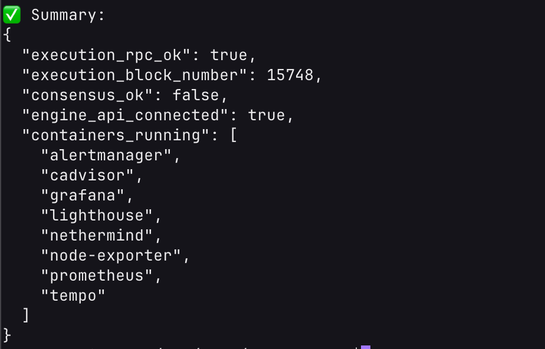
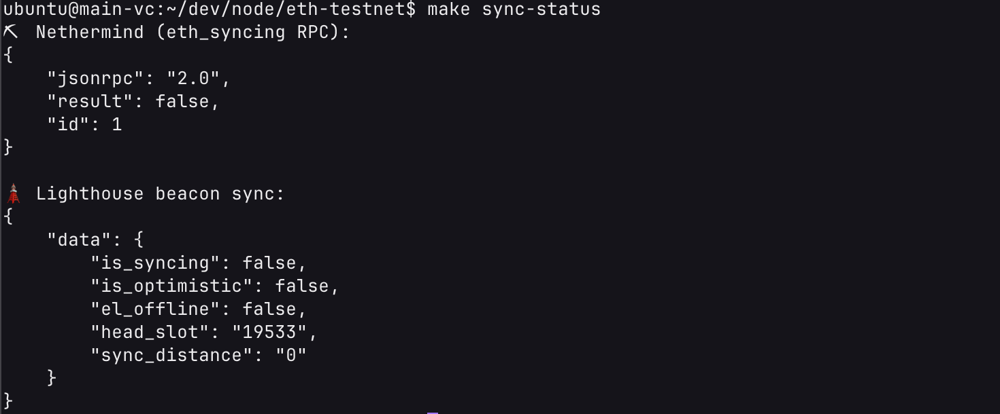
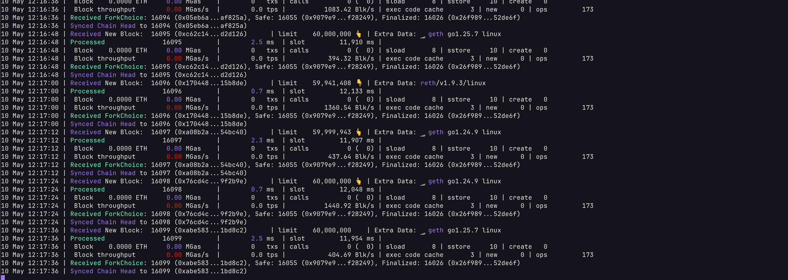
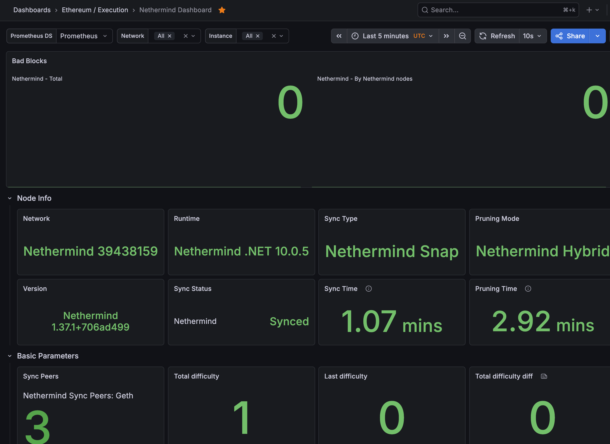
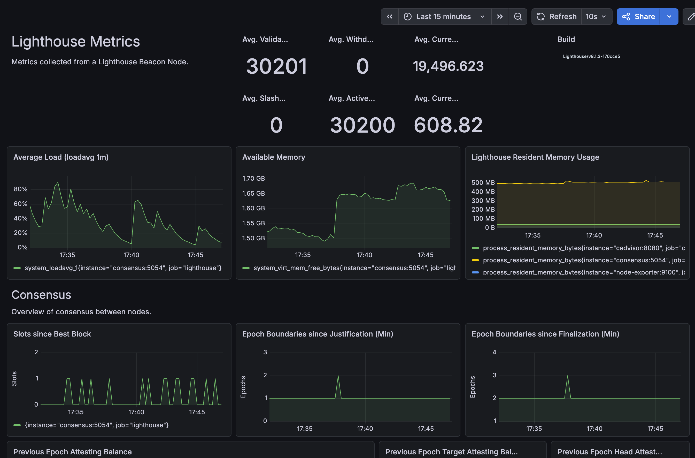
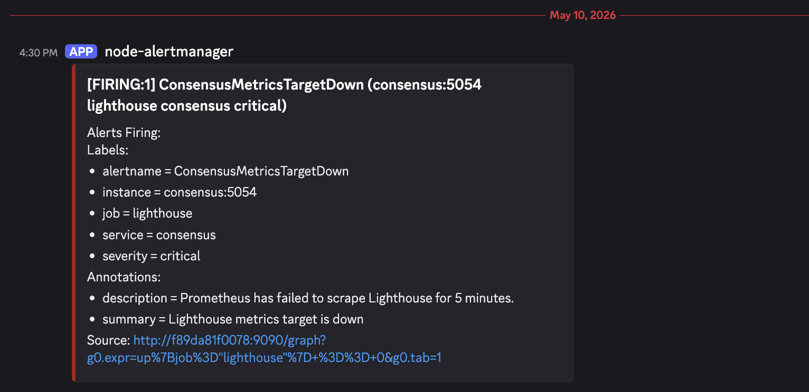

# Deploying an Ethereum Ephemery Node: A Complete Setup Guide

Running an Ethereum node is one of the best ways to understand the inner workings of the blockchain, but long-lived testnets like Sepolia or Holesky have massive state sizes that take hours or days to sync. Enter **Ephemery**, an ephemeral testnet that resets automatically (usually every few weeks). It's lightweight, fast to sync, and perfect for testing infrastructure, validator setups, and smart contracts without the baggage of heavy testnets.

This repository provides a robust, production-ready project designed to easily deploy an Ephemery node on AWS. It uses **Nethermind** for the execution layer, **Lighthouse** for the consensus layer, and includes a full **Prometheus/Grafana** observability stack.

---

## 🏗️ Project Architecture

This project is fully containerized and heavily automated. The node runs on Ephemery and exposes only the P2P ports publicly. RPC and dashboards stay bound to `127.0.0.1` on the host.

### 1. The Core Node
*   **Execution Client:** [Nethermind](https://nethermind.io/). Fast, C#-based client configured here with Snap Sync for rapid chain synchronization.
*   **Consensus Client:** [Lighthouse](https://lighthouse.sigp.io/). Rust-based client configured to use checkpoint sync from trusted Ephemery endpoints.

### 2. The Automation Engine
Ephemery networks "die" and reset periodically. This repository includes a bespoke script (`prepare_ephemery.sh`) that:
*   Downloads the latest Ephemery network bundle (genesis states, bootnodes, configs).
*   Automatically detects if the network has undergone a reset.
*   Clears out old Nethermind/Lighthouse data and restarts the node dynamically on the new iteration.

### 3. The Observability Stack
Visibility is critical when running blockchain infrastructure. This project provisions:
*   **Prometheus & Alertmanager:** For scraping metrics and routing critical alerts (e.g., node desync, disk space warnings) directly to Discord.
*   **Grafana & Tempo:** Dashboards for visualizing node health, P2P network peers, and host system metrics.
*   **cAdvisor & Node Exporter:** For granular container and host machine hardware metrics.

All of this is provisioned automatically on an AWS EC2 instance using **Terraform** and **Docker Compose**, orchestrated elegantly through a `Makefile`.

---

## 🛠️ Prerequisites

Before you begin, ensure your local machine has the following tools installed and configured:

1.  **Terraform:** To provision the AWS infrastructure.
2.  **AWS CLI:** Authenticated with permissions to create EC2 instances, security groups, and key pairs.
3.  **SSH Key Pair:** An existing `.pem` or `.pub` key pair on your machine to securely access the provisioned server.

---

## 🚀 Step-by-Step Setup Guide

### Step 1: Clone the Repository and Configure Environments

First, obtain the project repository and set up your local configuration variables.

```bash
# Copy the example environment file
cp .env.example .env
```

Open the `.env` file in your favorite text editor and fill in the required details:
*   `DISCORD_WEBHOOK_URL`: (Optional but recommended) Paste your Discord webhook to receive Alertmanager notifications.
*   `SSH_KEY`: The absolute path to your private SSH key (e.g., `~/.ssh/id_rsa`).
*   `GF_ADMIN_PASSWORD`: Choose a secure password to access your Grafana dashboard (defaults to `admin123`).

### Step 2: Deploy the Infrastructure

Deploying is as simple as running a single command. The `Makefile` abstracts away the complex Terraform initializations and remote execution.

```bash
make deploy
```

**What happens here?**
1. Terraform creates a new AWS EC2 instance and configures the necessary Security Groups. It explicitly exposes P2P ports (`30303` for Nethermind, `9000` for Lighthouse) to the public web but restricts RPC and dashboard ports to `127.0.0.1` for security.
2. The deployment script copies the project files to the EC2 instance.
3. A secure JWT secret is generated to authenticate communication between Nethermind and Lighthouse.
4. The Ephemery network files are downloaded, and Docker Compose spins up the entire node stack.

### Step 3: Monitor Node Status

Once deployed, you can easily check if your containers are healthy and monitor your sync status:

```bash
# Check the status of all Docker containers
make status

# Check the sync progress of the execution and consensus clients
make sync-status
```

If you need to dive deeper into the logs:
```bash
make logs-execution   # View Nethermind logs
make logs-consensus   # View Lighthouse logs
```

### Step 4: Access Grafana Dashboards

For security, Grafana is not exposed to the public internet. To view your node's metrics, open an SSH tunnel from your local machine to the EC2 instance:

```bash
make tunnel
```

Once the tunnel is active, open your web browser and navigate to `http://localhost:3000`. Log in using the username `admin` and the password you set in your `.env` file (`GF_ADMIN_PASSWORD`).

Here you will find pre-provisioned dashboards detailing exactly how your execution and consensus clients are performing!

---

## 🧰 Useful Commands

The `Makefile` is designed to be your primary operations center. Here are the most useful commands:

```bash
make help             # Show available commands
make deploy           # Provisions infrastructure and starts the node
make status           # Shows Docker Compose container states
make sync-status      # Displays real-time synchronization progress
make logs-execution   # View Nethermind logs
make logs-consensus   # View Lighthouse logs
make tunnel           # Opens an SSH tunnel for secure local port forwarding
make restart          # Safely restarts the Docker Compose stack
make destroy          # Tears down the AWS infrastructure via Terraform
```

---

## 🔌 Useful Endpoints

**On the EC2 host:**
- `localhost:8545` - Nethermind JSON-RPC
- `localhost:5052` - Lighthouse beacon API
- `localhost:9090` - Prometheus
- `localhost:9093` - Alertmanager
- `localhost:3000` - Grafana
- `localhost:3200` - Tempo

**Public peer-to-peer ports:**
- `30303/tcp,udp` - Nethermind
- `9000/tcp,udp` - Lighthouse

---

## 📁 Layout

- `Makefile`: Automates deployments, SSH tunnels, and node management.
- `deploy.sh`: Script run on the EC2 instance to initialize the node.
- `docker-compose.yml`: Defines the entire containerized node and observability stack.
- `prepare_ephemery.sh`: Fetches and manages Ephemery network resets.
- `terraform/`: Infrastructure-as-code definitions for AWS.
- `grafana/`: Dashboards and provisioning configuration.
- `prometheus/`: Prometheus configuration and alerting rules.
- `alertmanager/`: Alert routing to Discord.
- `tempo/`: Configuration for trace monitoring.

---

## 📸 Proof of Work

This project has been successfully deployed and verified. Below are snapshots demonstrating the healthy state of the node and the network architecture:

### Network Architecture
You can view the detailed network architecture diagram here: [Network Architecture Diagram](./network.excalidraw)

### Node Status & Sync
- **Docker Status (`make status`)**
  

- **Node Sync Status (`make sync-status`)**
  

- **Execution Client Logs**
  

### Dashboards & Observability
- **Nethermind Execution Dashboard**
  

- **Lighthouse Consensus Dashboard**
  

- **Alertmanager Alerts**
  

---

## 🏁 Conclusion

Setting up an Ethereum node doesn't have to be a painful, manual process. By utilizing Ephemery for rapid syncing and Terraform/Docker for automated deployments, this project allows you to spin up a production-grade Ethereum environment in minutes. Whether you are testing dApps, practicing Site Reliability Engineering (SRE), or preparing for a mainnet deployment, this setup provides a rock-solid foundation.
